  

  

  

 

<strong>AQUA LAUNCH</strong> · backend engineering · integrations · developer tooling

---

Live profile art refreshes automatically through <a href="./.github/workflows/update-profile.yml">GitHub Actions</a>. Built with the <a href="./scripts/generate.py">Aqua Launch generator</a>.

